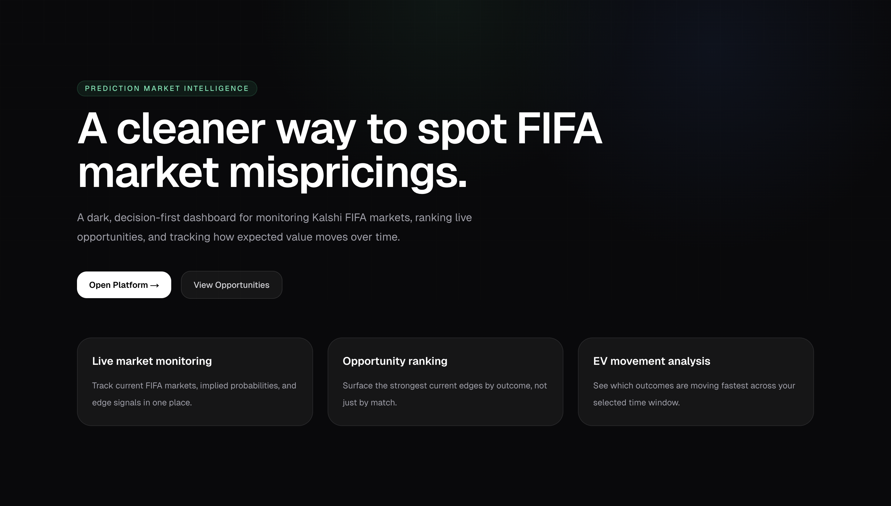
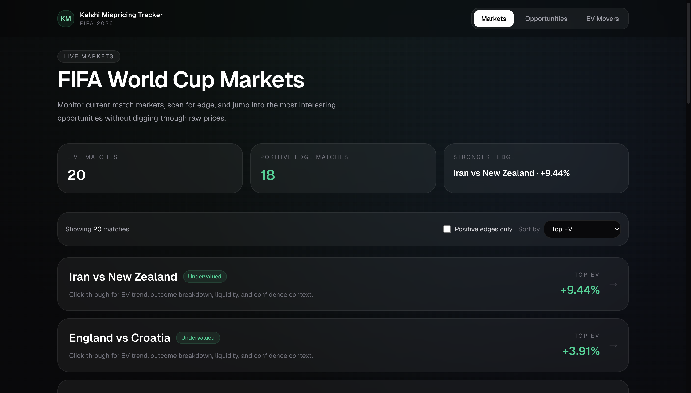
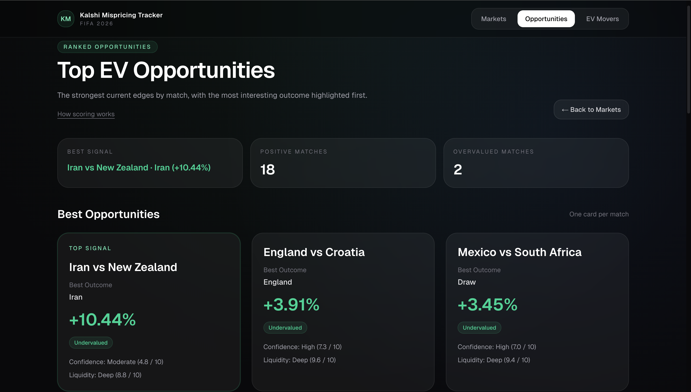
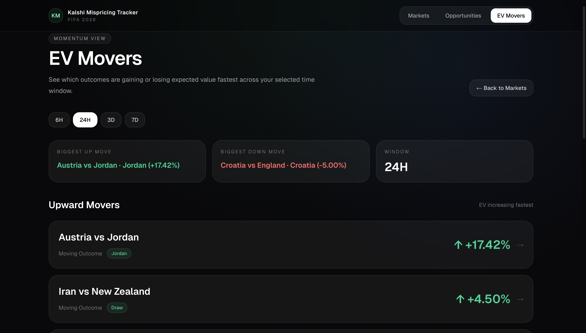
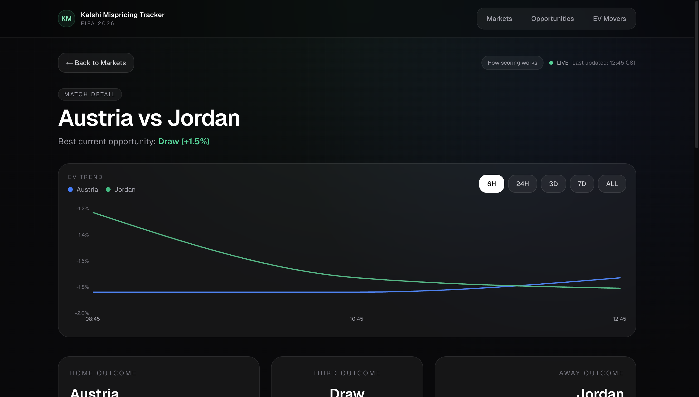
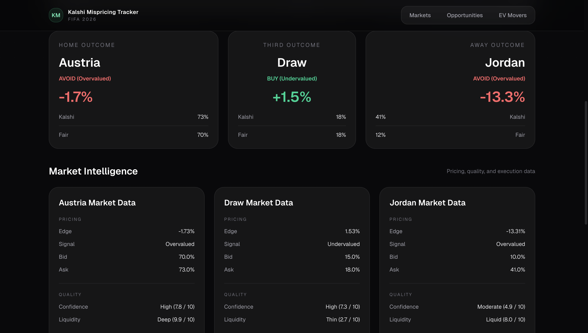
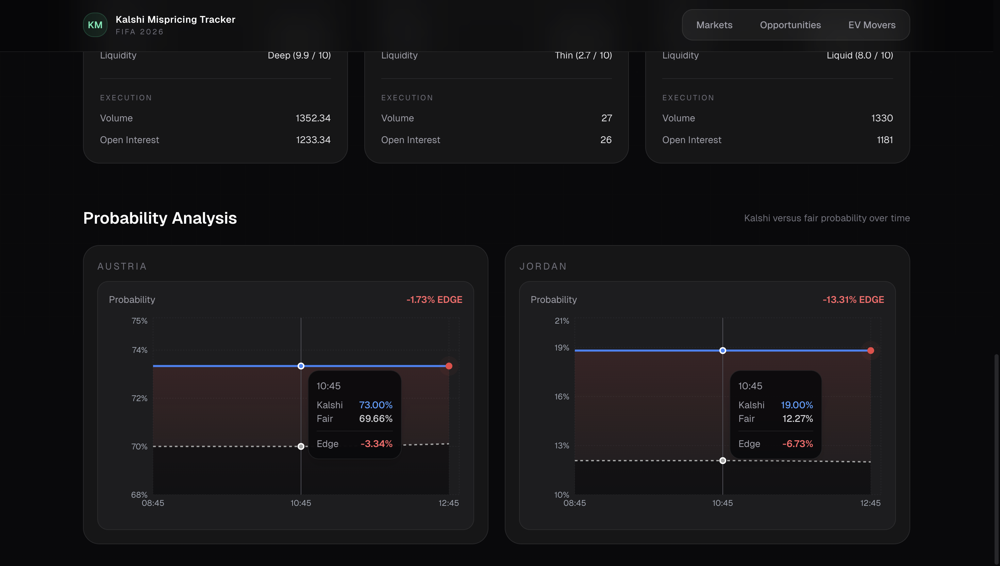

# Kalshi Mispricing Tracker — Frontend

A dark, decision-first dashboard for monitoring Kalshi FIFA markets, ranking live opportunities, and tracking how expected value moves over time.

**Live demo:** [mispricing.smitp.dev](https://mispricing.smitp.dev)

**Stack:** Next.js 15 · TypeScript · Tailwind CSS · Recharts · Vercel

---



## What it is

Kalshi lists binary contracts on FIFA match outcomes. Major sportsbooks publish odds that can be devigged into fair probabilities for the same outcomes. When the two disagree, there's an edge.

This is the frontend for a real-time mispricing tracker that surfaces those edges, ranks them, and shows how they move.

The backend — FastAPI + SQLite, running on an Oracle Cloud ARM VM behind a Cloudflare Tunnel — lives in a separate repo: **[fifa-mispricing-tracker](https://github.com/smituic/fifa-mispricing-tracker)**.

## Features

### Live markets view
All live FIFA matches with their current top EV signal, sortable and filterable.



### Ranked opportunities
The strongest current edges across all matches, one card per match, with the most interesting outcome highlighted first.



### EV movers
Biggest upward and downward expected-value moves across a selected time window — 6h, 24h, 3d, or 7d.



### Match detail
Per-match deep dive with EV trend chart, Kalshi-versus-fair probability analysis, and full market intelligence (pricing, quality scores, and execution data like volume and open interest).





## Architecture

```
Browser
   │
   │  https://mispricing.smitp.dev
   ▼
Vercel Edge Network (Next.js SSR + static)
   │
   │  browser JS calls https://api.smitp.dev/...
   ▼
Cloudflare Tunnel
   │
   ▼
FastAPI backend on Oracle Cloud VM
   │
   ▼
SQLite (snapshot history)
```

Frontend deploys automatically to Vercel on every push to `main`. The production `NEXT_PUBLIC_API_URL` points at the backend tunnel.

## Tech stack

- **Framework:** Next.js 15 (App Router, server components, Turbopack)
- **Language:** TypeScript
- **Styling:** Tailwind CSS with a dark, premium design system (glass cards, consistent radii, restrained color palette)
- **Charts:** Recharts (EV trend, probability comparison)
- **Deployment:** Vercel (edge network, CI via GitHub integration)
- **DNS + TLS:** Cloudflare (apex + subdomain)

## Running locally

### Prerequisites

- Node.js 20+
- The backend running locally, or the production backend URL

### Setup

```bash
git clone https://github.com/smituic/fifa-mispricing-frontend.git
cd fifa-mispricing-frontend

npm install

# Configure environment
cp .env.example .env.local
# Edit .env.local if you want to point at a non-local backend

npm run dev
```

Open [http://localhost:3000](http://localhost:3000).

### Environment variables

See [`.env.example`](./.env.example).

- `NEXT_PUBLIC_API_URL` — base URL for the backend API. Local dev: `http://localhost:8000`. Production: `https://api.smitp.dev`.

## Project structure

```
fifa-mispricing-frontend/
├── app/
│   ├── page.tsx                  # Landing
│   ├── fifa/                     # Live markets list
│   ├── opportunities/            # Ranked opportunities
│   ├── movers/                   # EV movers
│   └── match/[match_id]/         # Per-match deep dive
├── components/                   # Shared UI (TopNav, cards, charts)
├── lib/
│   └── api.ts                    # Central API client (NEXT_PUBLIC_API_URL)
├── docs/screenshots/             # Product screenshots (used in this README)
└── public/
```

## Deployment

Deploys automatically to Vercel on every push to `main`. Production environment variables live in the Vercel dashboard.

## License

Portfolio / demo project. Not a trading tool. Data is for illustration only.
